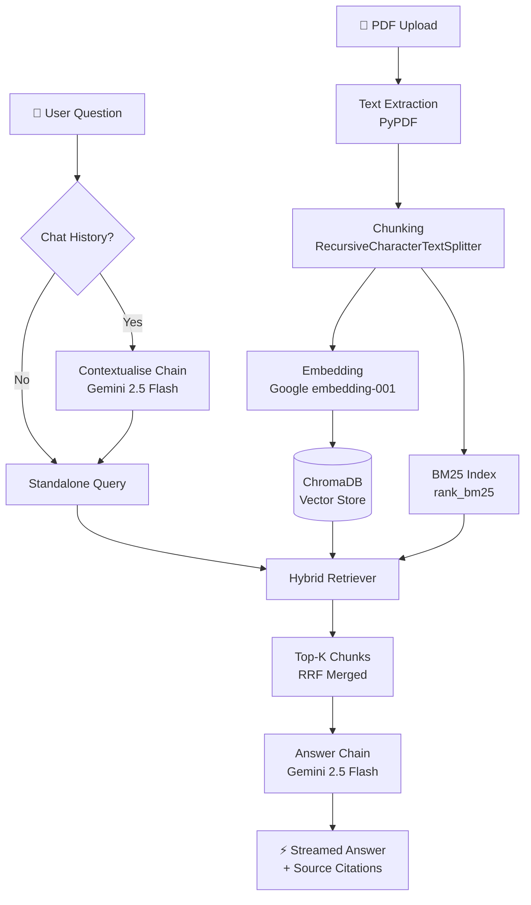

<div align="center">

# 📄 PDF AI ChatBot

### Intelligent Document Q&A powered by LangChain, Gemini & ChromaDB

[](https://streamlit.io)
[](https://langchain.com)
[](https://ai.google.dev)
[](LICENSE)
[](https://python.org)

**[🚀 Live Demo](https://pdfaichatbot-v8jke44ch5pxzjvfpzmafr.streamlit.app/)** · **[📖 Documentation](#design-decisions)** · **[🐛 Report Bug](https://github.com/PrathamUdayG/pdf_ai_chatbot/issues)**

</div>

---

## ✨ Features

| Feature | Description |
|---------|-------------|
| 📤 **Multi-PDF Upload** | Upload and process multiple PDFs (up to 50 MB each) |
| 🔍 **Hybrid Search** | BM25 keyword + vector semantic search with Reciprocal Rank Fusion |
| 💬 **Streaming Responses** | Real-time token-by-token answer generation |
| 📚 **Source Citations** | Every answer cites the exact document and page number |
| 🧠 **Conversation Memory** | Context-aware follow-up questions using chat history |
| 🎨 **Premium Dark UI** | Modern glassmorphism design with gradient accents |
| 🐳 **Docker Support** | One-command deployment with Docker |
| 💸 **Zero Cost** | Entirely free — Gemini API free tier + local ChromaDB |

---

## 🏗️ Architecture



---

## 🧩 Design Decisions

### Chunking Strategy

| Parameter | Value | Rationale |
|-----------|-------|-----------|
| **Method** | `RecursiveCharacterTextSplitter` | Respects natural text boundaries (paragraphs → sentences → words) |
| **Chunk size** | 1,000 chars | Balances context richness with retrieval precision |
| **Overlap** | 200 chars | Preserves context at chunk boundaries |
| **Separators** | `\n\n`, `\n`, `. `, ` `, `` | Hierarchical splitting for clean semantic units |

Each chunk retains metadata: **source filename**, **page number**, and **chunk index** for precise citation.

### Embedding Model Choice

| Aspect | Detail |
|--------|--------|
| **Model** | `models/embedding-001` (Google Generative AI) |
| **Dimensions** | 768 |
| **Cost** | Free (Google AI free tier) |
| **Why?** | No local GPU needed, no `torch`/`transformers` dependency — keeps deployment light (~50 MB vs ~2 GB) |

### Retrieval Approach — Hybrid Search

We combine **two complementary retrieval methods** using Reciprocal Rank Fusion (RRF):

1. **Vector Search (weight: 0.7)** — Semantic similarity via Google embeddings in ChromaDB. Captures meaning even when exact words differ.

2. **BM25 Search (weight: 0.3)** — Keyword matching via `rank_bm25`. Catches exact terms, acronyms, and names that embedding models may miss.

3. **RRF Merger** — Both result sets are fused using `1 / (k + rank)` scoring, producing a final top-5 list that benefits from both precision and recall.

### Prompt Design

Two-stage prompt architecture using LCEL (LangChain Expression Language):

1. **Contextualise Chain** — Rewrites follow-up questions into standalone queries using the last 6 messages of chat history. This ensures the retriever gets a clear, self-contained question.

2. **Answer Chain** — Grounded QA prompt with strict rules:
   - Answer ONLY from provided context
   - Cite source document name and page number
   - Graceful fallback when answer is not found
   - Markdown-formatted output

---

## 🚀 Quick Start

### Prerequisites

- Python 3.11+
- A [Google AI API key](https://aistudio.google.com/apikey) (free)

### Local Setup

```bash
# 1. Clone the repository
git clone https://github.com/PrathamUdayG/pdf_ai_chatbot.git
cd pdf_ai_chatbot

# 2. Create virtual environment
python -m venv venv
source venv/bin/activate  # Windows: venv\Scripts\activate

# 3. Install dependencies
pip install -r requirements.txt

# 4. Set your API key
echo "GOOGLE_API_KEY=your_key_here" > .env

# 5. Run the app
streamlit run app.py
```

### Docker Setup

```bash
# Build and run
docker build -t pdf-ai-chatbot .
docker run -p 8501:8501 -e GOOGLE_API_KEY=your_key_here pdf-ai-chatbot
```

Open [http://localhost:8501](http://localhost:8501) in your browser.

---

## 📁 Project Structure

```
pdf-ai-chatbot/
├── app.py                  # Main Streamlit app (UI + orchestration)
├── config.py               # Centralised configuration
├── core/
│   ├── __init__.py
│   ├── pdf_processor.py    # PDF extraction + chunking
│   ├── vector_store.py     # ChromaDB + Google embeddings
│   ├── retriever.py        # Hybrid BM25 + vector retriever (RRF)
│   └── chain.py            # LLM chains (LCEL)
├── .streamlit/
│   └── config.toml         # Streamlit theme + upload config
├── requirements.txt        # Python dependencies
├── Dockerfile              # Docker deployment
├── .dockerignore
├── .gitignore
├── .env                    # API key (git-ignored)
├── LICENSE
└── README.md
```

---

## 🛠️ Tech Stack

| Component | Technology | Cost |
|-----------|-----------|------|
| **LLM** | Gemini 2.5 Flash | Free |
| **Embeddings** | Google `embedding-001` | Free |
| **Vector DB** | ChromaDB (in-memory) | Free |
| **Keyword Search** | BM25 via `rank_bm25` | Free |
| **Framework** | LangChain 1.3+ (LCEL) | Free |
| **Frontend** | Streamlit | Free |
| **Deployment** | Streamlit Community Cloud | Free |

**Total cost: $0**

---

## 📊 Evaluation Alignment

| Criteria | Weight | How We Address It |
|----------|--------|-------------------|
| **Correctness** | 30% | Grounded prompts + Gemini 2.5 Flash + strict "answer from context only" rules |
| **Retrieval Quality** | 25% | Hybrid search (BM25 + vector) with RRF fusion for high recall + precision |
| **Code Quality** | 20% | Modular architecture, type hints, docstrings, LCEL patterns, single-responsibility modules |
| **UI/UX** | 10% | Premium dark theme, streaming responses, citation cards, stat dashboard |
| **Deployment** | 10% | Live on Streamlit Cloud + Docker support |
| **Documentation** | 5% | This README with architecture diagram, design decisions, and setup guide |

---

## 📜 License

This project is licensed under the Apache License 2.0 — see the [LICENSE](LICENSE) file for details.

---

<div align="center">

**Built with ❤️ using LangChain, Gemini & ChromaDB**

</div>
